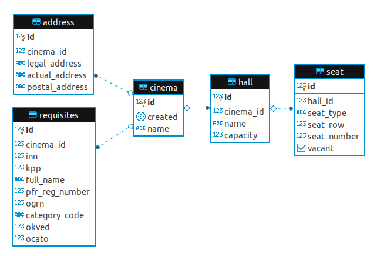

## Сервис для бронирования мест в кинотеатрах

### Системные требования

1. **ОС Linux**
1. **docker 19.03.6** или выше
1. **docker compose 1.23.1** или выше
1. **Java 8** и выше
1. **PostgreSQL 9.6** 

### Требования к компоненту

Требования к компоненту находятся в документе [Requirements](https://github.com/Petrovvich/test-task/blob/master/docs/Requirements.md).


### API

### Реляционная модель



##### Таблица **cinema** - представление зала кинотеатра

- **id** - первичный ключ
- **created** - дата создания записи в бд
- **name** - название кинотеатра
- **address_id** - внешний ключ на таблицу **address** 
- **requisites_id** - внешний ключ на таблицу **requisites**

##### Таблица **hall** - представление зала кинотеатра

- **id** - первичный ключ
- **cinema_id** - внешний ключ на тыблицу **cinema**
- **name** - название зала
- **capacity** - вместимость зала

##### Таблица **seat** - представление посадочного места

- **id** - первичный ключ
- **hall_id** - внешний ключ на тыблицу **hall**
- **seat_type** - тип посадочного места (SIMPLE - обычное место, VIP - для vip гостей)
- **seat_row** - номер ряда посадочного места
- **seat_number** -  номер посадочного места в ряде

##### Таблица **address** - представление адресов кинотеатра

- **id** - первичный ключ
- **legal_address** - юридический адрес кинотеатра
- **actual_address** - фактический адрес кинотеатра 
- **postal_address** - почтовый адрес кинотеатра 

##### Таблица **requisites** - представление реквизитов (не платежных) юридического лица владеющего кинотеатром

- **id** - первичный ключ
- **inn** - ИНН юридического лица
- **kpp** - КПП юридического лица
- **full_name** - полное наименование юридического лица
- **pfr_reg_number** - регистрационный номер в ПФР (как работодателя) юридического лица
- **ogrn** - ОГРН юридического лица
- **category_code** - код категории
- **okved** - ОКВЭД юридического лица
- **ocato** - ОКАТО юридического лица

### Инструкция по запуску

Для запуска прилоэже
```
docker-compose -f module-docker-compose.yml up --build --remove-orphans
```